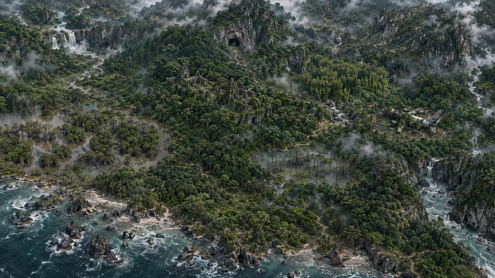

# Green Horizon Wilderness Survival Simulation

> A personal, systems-heavy tropical rainforest survival and colony simulation prototype built for the browser.



Green Horizon is an experimental survival game project focused on **long-term wilderness simulation rather than scripted survival set pieces**. The player begins with limited resources in a hostile tropical environment, explores and learns the island, builds a camp, manages equipment and logistics, and can eventually grow a small self-sustaining settlement.

This repository is primarily a **personal development sandbox**. It is public for transparency, experimentation, and easier CI usage; it should not be treated as a finished game or stable framework.

## Project status

**Active prototype / pre-release.**

Systems, data models, balance values, save formats, UI, and art are still changing frequently. The current development focus is the authoritative spatial world and living ecology simulation.

### Current spatial world foundation

The current world model uses:

- a canonical **120 km² tropical island**;
- **10 stable authored macro regions** used for navigation and game-facing identity;
- a seeded habitat lattice at roughly **600 m** spatial resolution;
- **70 generated natural Local Sites + 3 required landmarks**;
- generated terrain, hydrology, habitat suitability, travel cost, and local ecological influence;
- deterministic world generation from a campaign seed.

Macro regions remain recognizable between campaigns while the local wilderness underneath them can vary.

### Living terrestrial ecology

The authoritative spatial terrestrial stack is designed as one connected food web:

```text
living flora
    ↓
insects + shared material resource pools
    ↓
non-predator fauna
    ↓
spatial predators
```

Current spatial ecology data includes:

- **40+ flora taxa/guilds** across 13 structural strata;
- **20+ insect taxa/guilds**;
- **24 non-predator terrestrial fauna species**;
- **5 spatial predator species**;
- conserved per-patch plant food, insect biomass, carrion, and fresh-water resources;
- habitat-dependent movement, competition, breeding, mortality, carrying capacity, predator home ranges, energy reserve, and recovery behavior.

Legacy terrestrial ecology modules are still present for compatibility and data bridging, but the active spatial implementation lives primarily under `src/simulation/spatial/`.

## Gameplay direction

The project is intended to move gradually from difficult solo survival toward settlement management.

Core design goals include:

- **Exploration** — inspect terrain, discover Local Sites, evaluate routes, and learn where resources actually exist.
- **Survival** — food, water, fatigue, health, weather exposure, equipment condition, and environmental risk matter over time.
- **Physical logistics** — inventory, storage, hauling, weight, volume, freshness, and material movement are modeled instead of abstracted into one global stockpile.
- **Crafting & equipment** — tools are built, repaired, modified, and upgraded from physical materials and components.
- **Camp development** — construction, storage, utilities, food production, farming, defenses, and work assignment grow in importance as the settlement expands.
- **Living ecology** — plants, prey, predators, water, harvesting pressure, and regeneration are intended to interact rather than exist as isolated resource nodes.
- **Long simulation horizons** — ecology and colony systems are tested over months and years, not only short gameplay ticks.

The design deliberately favors understandable ecological mechanisms over hidden balance buffs where possible.

## Major implemented systems

The repository currently contains working or actively developed foundations for:

- survivor state and party management;
- inventory, storage networks, hauling, and reservation;
- component-based items, wear, repair, crafting, research, and upgrades;
- construction, building clusters, workstations, utilities, and maintenance;
- agriculture and food-production simulation;
- save migration and persistence;
- dynamic weather and environmental simulation;
- hydrology and surface-water systems;
- terrestrial and aquatic ecology;
- seeded spatial world generation and Local Sites;
- living flora, insects, fauna, predators, and trophic resource accounting;
- encounter/UI prototypes;
- Canvas/WebGL map effects and tropical survival UI.

See `docs/` for design notes, architecture documents, spatial-world notes, and simulation reports.

## Tech stack

- **React 19**
- **TypeScript 5.8**
- **Vite 6**
- **Tailwind CSS 4**
- **Lucide React**
- HTML Canvas / WebGL-based map effects
- Browser LocalStorage / JSON save serialization
- Node/TypeScript simulation smoke tests

## Running locally

CI currently targets **Node.js 22**.

```bash
git clone https://github.com/kirito9554/Green-Horizon-Wilderness-Survival-Simulation.git
cd Green-Horizon-Wilderness-Survival-Simulation
npm ci
npm run dev
```

The development server runs on port `3000` by default.

Production build:

```bash
npm run lint
npm run build
```

### Environment files

Real environment files are intentionally ignored by Git:

```text
.env*
!.env.example
```

`.env.example` contains placeholders only. **Do not commit real API keys, tokens, credentials, or local secrets.**

The core simulation does not require secrets to run its normal local smoke tests.

## Testing

The project relies heavily on deterministic smoke tests and long-running simulation checks.

Useful commands:

```bash
# TypeScript
npm run lint

# World / fauna foundations
npm run test:spatial-world
npm run test:spatial-fauna
npm run test:spatial-fauna-runtime
npm run test:spatial-fauna-competition
npm run test:spatial-fauna-resources

# Predator regressions and full trophic runtime
npm run test:spatial-predator-founders
npm run test:spatial-predator-p6
npm run test:spatial-predator-p7
npm run test:spatial-predator-p8
npm run test:spatial-trophic

# Multi-year ecology soak
npm run test:spatial-trophic-soak

# Other simulation suites
npm run test:production
npm run test:building
npm run test:storage
npm run test:agriculture
npm run test:hydrology
npm run test:ecology
```

The multi-year trophic soak is intentionally much heavier than the normal smoke tests. It is used to inspect population trajectories, resource pressure, predator energy accounting, extinction/recovery behavior, and long-term ecological stability.

## Repository layout

```text
public/
  maps/               World-map artwork
  poi-bg/             POI environment artwork
  poi-card/           POI cards
  iconsets/           Item/resource icons
  weather-card/       Weather artwork
  ui/                 UI artwork

docs/
  GAME_DESIGN.md
  SYSTEM_ARCHITECTURE.md
  DATA_SCHEMA.md
  ART_BIBLE.md
  ASSET_MANIFEST.md
  spatial-world-foundation.md
  spatial-fauna-community.md
  spatial-trophic-multiyear-soak.md

src/
  components/         React UI
  data/               Static game/ecology definitions
  encounter/          Encounter prototype
  save/               Save + migration logic
  simulation/         Simulation systems
  simulation/spatial/ Seeded world and authoritative spatial ecology
  types/              TypeScript state/contracts
  utils/              Shared utilities

scripts/              Deterministic smoke tests and simulation soaks
.github/workflows/    CI and long-run ecology workflows
```

## Art and asset notes

Most project-specific visual assets are stored directly under `public/`. Lucide icons are provided by the `lucide-react` dependency and retain their upstream license.

The project is still experimental, and asset provenance/licensing documentation should be treated separately from code architecture. See `docs/ASSET_MANIFEST.md` for the current inventory.

If an asset is replaced or imported from another source, its provenance and reuse terms should be documented before committing it.

## Security / public-repository hygiene

Before publishing or sharing a build:

- keep real `.env` files out of Git;
- never hard-code API keys or access tokens;
- avoid committing machine-specific paths, private logs, or personal exports;
- keep generated simulation artifacts out of the repository unless they are intentionally part of documentation;
- treat save files as potentially user-specific data.

## License

There is currently **no project-wide open-source license** attached to Green Horizon.

Public visibility does **not** automatically grant reuse rights to the source code or original project assets. Third-party dependencies and assets retain their respective licenses.

A project-wide license can be chosen later if the repository is intended to become reusable/open source rather than simply publicly viewable.

## Development philosophy

Green Horizon is intentionally being built as a simulation-first personal project. The priority is not rapid feature count; it is making the systems underneath survival — ecology, logistics, resources, equipment, weather, and settlement growth — interact in ways that remain believable over long time horizons.

Expect experiments, discarded approaches, migration code, diagnostics, and unusually detailed simulation tests. That is part of the project.
